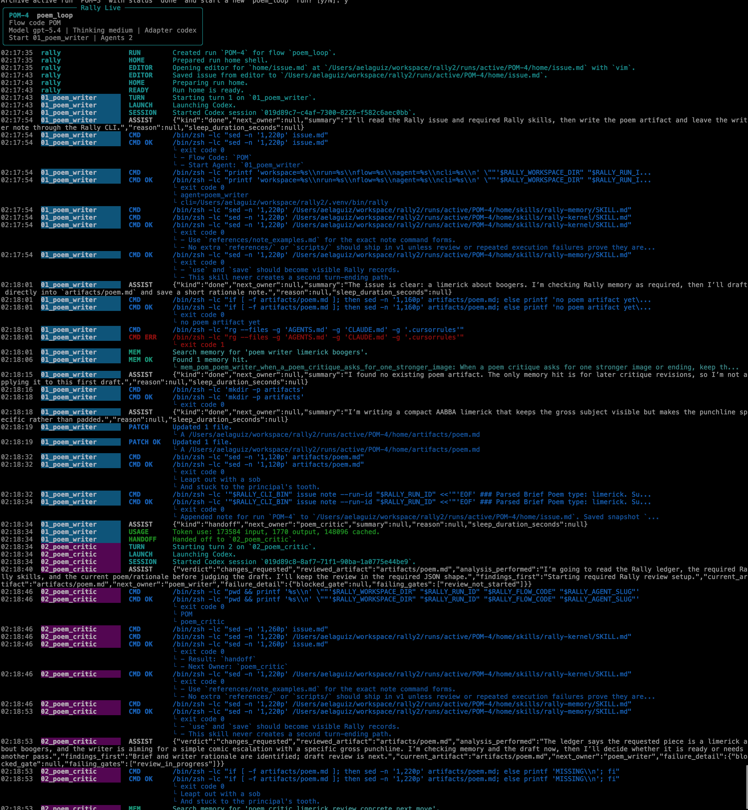

# Rally

[](LICENSE)
[](pyproject.toml)
[](https://github.com/aelaguiz/rally/actions/workflows/ci.yml)
[](https://github.com/aelaguiz/doctrine)

[Doctrine](https://github.com/aelaguiz/doctrine) · [Contributing](CONTRIBUTING.md)

Run coding-agent workflows from plain repo files.

Rally is a filesystem-first agent harness for multi-agent coding workflows. You author the flow in Doctrine, Rally materializes a run home inside the repo, routes each turn from strict JSON, and leaves the full execution on disk instead of in a hidden control plane.

> Flows are code. Runs are files.

> Status: early, real, and already useful. Codex and Claude Code support ship today. Repo-local searchable memory and allowlisted MCP surfaces ship today. The checked-in demo flows still default to Codex.

## Live demo

Rally running the shipped `poem_loop` flow from the real CLI.



## Why Rally is different

- run history lives under `runs/`
- one active run per flow stays easy to reason about
- turn control comes from strict JSON, not prose guessing
- the operator can inspect `issue.md`, artifacts, logs, and sessions on disk
- resume paths stay honest because the state is visible

## Doctrine and Rally

- Use Doctrine when you want to author and validate the flow.
- Use Rally when you want to run that flow with repo-local state and strict turn routing.
- Keep the split crisp: Doctrine is the authoring layer, Rally is the runtime layer.

## What Rally is for

Use Rally if you want:

- repeatable coding-agent workflows
- clear owners, clear artifacts, and clear stop points
- repo-local runtime state instead of a hidden control plane
- workflows you can diff, test, and review like software
- a harness that is small enough to inspect with normal developer tools

## Quickstart

Today Rally expects the Doctrine repo beside it at `../doctrine`. The quickstart below uses that real layout.

```bash
gh repo clone aelaguiz/doctrine ../doctrine
git clone https://github.com/aelaguiz/rally.git
cd rally
uv sync --dev
```

Build the checked-in flow and skill readback that Rally loads at runtime:

```bash
uv run python -m doctrine.emit_docs --pyproject pyproject.toml --target _stdlib_smoke --target poem_loop --target software_engineering_demo
uv run python -m doctrine.emit_skill --pyproject pyproject.toml --target rally-kernel --target rally-memory --target demo-git
```

Run the smallest end-to-end demo:

```bash
uv run rally run poem_loop
```

If you do not have an interactive editor configured, Rally will stop and tell you where the issue file lives. On a fresh repo, that path will be:

```text
runs/active/POM-1/home/issue.md
```

Write the issue there, then resume the run:

```bash
uv run rally resume POM-1
```

Run the unit tests any time with:

```bash
uv run pytest tests/unit -q
```

## What ships today

Rally already has:

- Doctrine-authored flows and generated readback under `flows/*/build/**`
- live Codex and Claude Code adapter paths
- repo-local run homes, issue history, logs, and restartable runs
- strict `handoff`, `done`, `blocker`, and `sleep` turn results
- repo-local searchable memory
- allowlisted skills and MCP materialization into the run home
- two demo flows:
  - `poem_loop`
  - `software_engineering_demo`

## Why this angle matters

A lot of agent tooling still hides the important truth in dashboards, opaque state, or giant piles of copied prompt prose.

Rally takes a different bet:

- keep the runtime small
- keep the run visible
- keep ownership changes explicit
- keep the stop rules typed
- keep recovery paths boring and honest

If the story only works when the control plane is hidden, the runtime is not trustworthy enough yet.

## Read next

- [docs/RALLY_MASTER_DESIGN_2026-04-12.md](docs/RALLY_MASTER_DESIGN_2026-04-12.md)
- [docs/RALLY_CLI_AND_LOGGING_2026-04-13.md](docs/RALLY_CLI_AND_LOGGING_2026-04-13.md)
- [docs/RALLY_QMD_AGENT_MEMORY_MODEL_2026-04-13.md](docs/RALLY_QMD_AGENT_MEMORY_MODEL_2026-04-13.md)
- [docs/RALLY_CLAUDE_CODE_FIRST_CLASS_ADAPTER_SUPPORT_2026-04-13.md](docs/RALLY_CLAUDE_CODE_FIRST_CLASS_ADAPTER_SUPPORT_2026-04-13.md)
- [Doctrine](https://github.com/aelaguiz/doctrine)
- [CONTRIBUTING.md](CONTRIBUTING.md)

## Questions and contributions

- Use [Discussions](https://github.com/aelaguiz/rally/discussions) for questions and design talk.
- Use [Issues](https://github.com/aelaguiz/rally/issues) for clear bugs or scoped proposals.
- See [CONTRIBUTING.md](CONTRIBUTING.md) for the bootstrap and proof commands.

If this direction is useful, star the repo and watch releases.
